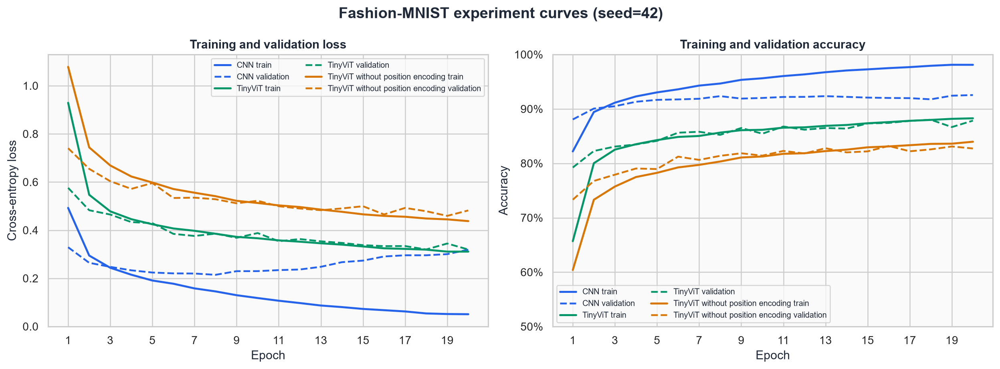
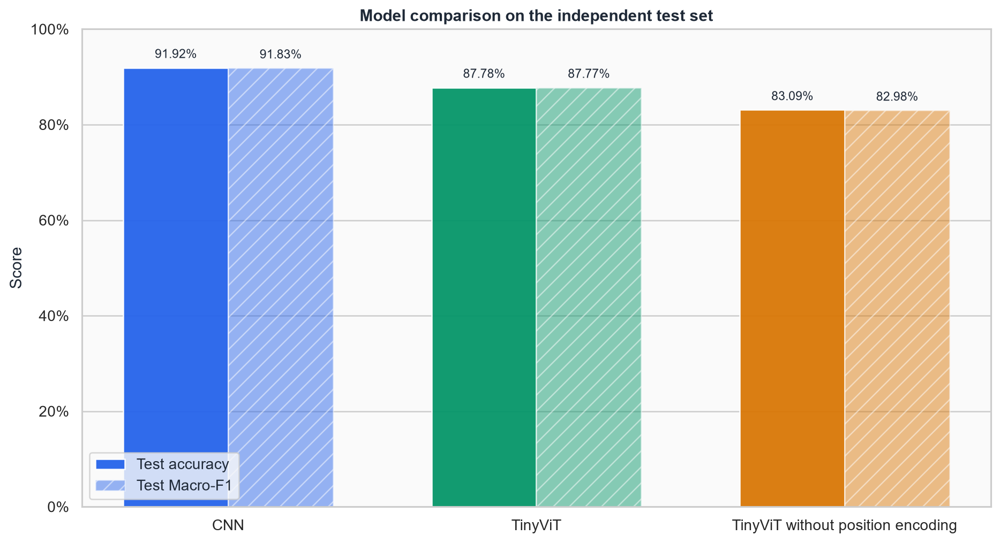
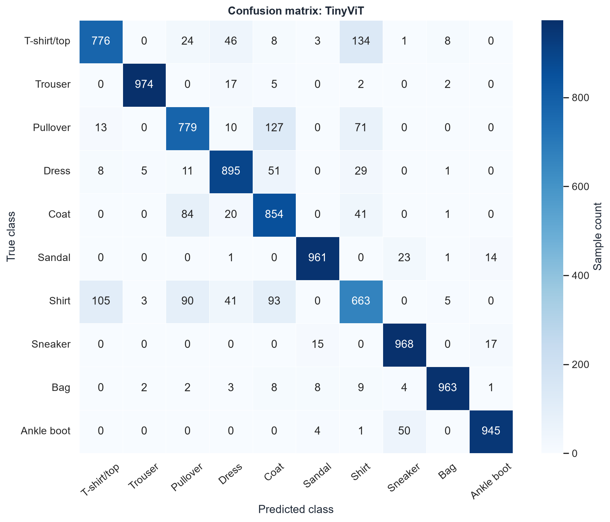
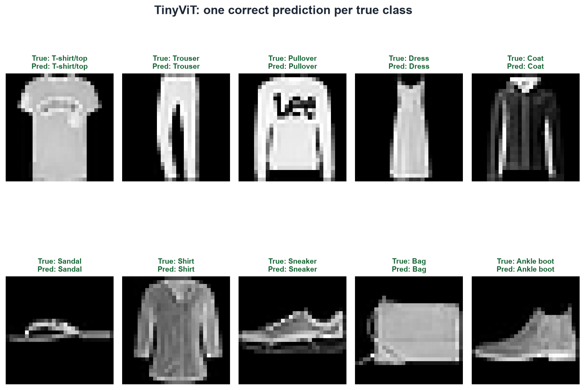
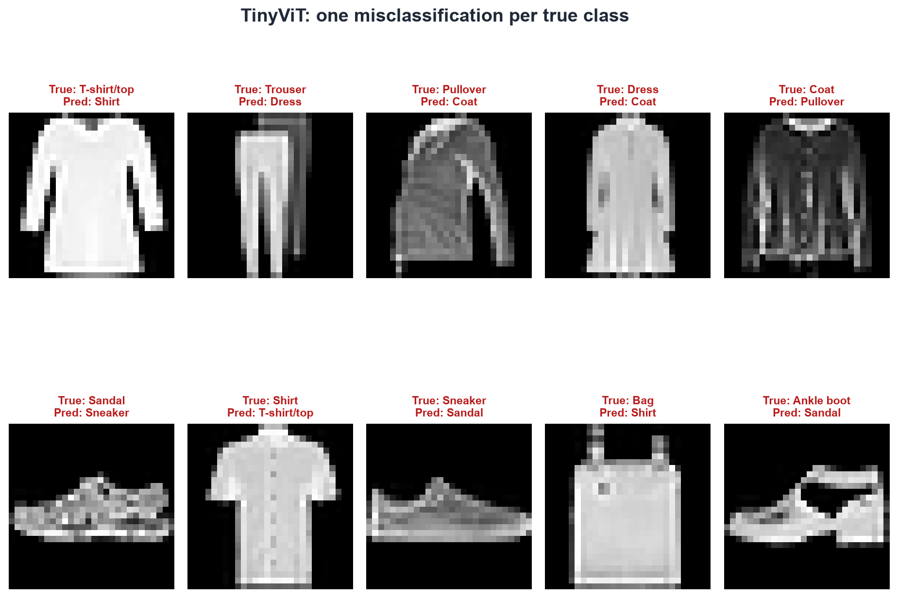

# 实验结果与分析

## 1. 实验设置

三组实验均使用 Fashion-MNIST、相同的 54,000/6,000/10,000 训练/验证/测试划分、随机种子 42、batch size 128、20 个 epoch、AdamW 优化器、学习率 0.001 和权重衰减 0.0001。模型只根据验证集表现选择 `best.pt`，测试集不参与调参。

这一设置的目的不是寻找每个模型的最高精度，而是在尽可能一致、容易解释的条件下回答两个问题：

1. 当前 TinyViT 与简单 CNN 基线相比表现如何？
2. 移除位置编码后，TinyViT 会发生什么变化？

## 2. 总体结果

| 模型              | 参数量   | 最佳 epoch | 验证 Accuracy | 测试 Accuracy | 测试 Macro-F1 | 训练时间 |
|---                |---:     |---:        |---:          |---:           |---:           |---:     |
| CNN               | 96,362  | 20         | 92.55%        | 91.92%       | 0.9183        | 101.41s |
| TinyViT           | 105,098 | 18         | 88.02%        | 87.78%       | 0.8777        | 101.98s |
| TinyViT 无位置编码 | 101,898 | 16         | 83.20%        | 83.09%       | 0.8298        | 103.42s |

三个模型的验证集与测试集差距分别为 0.63、0.24 和 0.11 个百分点，结果较为一致，没有明显的数据泄漏或只在验证集上有效的迹象。Accuracy 与 Macro-F1 也非常接近，这与 Fashion-MNIST 测试集类别均衡相符。

## 3. CNN 与 TinyViT

CNN 的测试 Accuracy 比 TinyViT 高 4.14 个百分点，同时参数量略少、训练时间几乎相同。在这个实验中，CNN 是更有效的模型。

合理解释是：Fashion-MNIST 只有 28×28 像素，类别判断高度依赖边缘、轮廓和邻近像素组成的局部纹理。CNN 把“局部连接”和“平移共享”直接写入网络结构，因此具有适合该任务的归纳偏置。TinyViT 需要从数据中学习 patch 之间的关系，在数据规模和训练预算有限时不一定占优。

训练曲线也显示不同特征：CNN 最终训练 Accuracy 达到 98.11%，验证 Accuracy 为 92.55%，存在约 5.56 个百分点的泛化差距；TinyViT 的训练与验证 Accuracy 都在 88% 左右，更像是当前模型规模、优化配置和训练预算下的欠拟合或优化受限。这里不能据此得出“CNN 永远优于 Transformer”，只能说明当前任务和配置更有利于 CNN。

## 4. 位置编码消融

无位置编码 TinyViT 与完整 TinyViT 的唯一区别，是删除了形状为 `[1, 50, 64]` 的可学习位置编码，共减少 3,200 个参数。其测试 Accuracy 从 87.78% 降至 83.09%，下降 4.69 个百分点；Macro-F1 从 0.8777 降至 0.8298。

自注意力计算会比较 token 内容，但如果没有额外位置信息，它本身不知道某个 patch 位于图像左上角、中心还是右下角。图像分类需要理解袖子、鞋底、领口等结构之间的空间关系，因此位置编码能够提供有意义的空间顺序信息。

下降并非集中在单一类别。相比无位置编码模型，完整 TinyViT 在 Coat、Shirt 和 Dress 上的 F1 分别提高约 10.70、7.67 和 6.21 个百分点，说明空间位置对外形相近服装的区分尤其重要。

这项消融可以支持“位置编码对当前 TinyViT 有明显帮助”，但一次随机种子的结果不足以精确估计其平均提升幅度。

## 5. 混淆矩阵与类别难点

TinyViT 最困难的类别是 Shirt，测试 F1 为 0.6800。主要错分包括：

- T-shirt/top → Shirt：134 张
- Pullover → Coat：127 张
- Shirt → T-shirt/top：105 张
- Shirt → Coat：93 张
- Shirt → Pullover：90 张

这些类别都属于上衣，在低分辨率灰度图中轮廓和纹理相似。相对而言，Trouser、Bag、Sandal、Sneaker 和 Ankle boot 具有更独特的整体形状，F1 较高。

CNN 仍会混淆 Shirt 与其他上衣，但 Shirt F1 提高到 0.7541；无位置编码 TinyViT 的 Shirt F1 进一步降至 0.6033。三张混淆矩阵共同说明，总体 Accuracy 的差距主要来自相似服装类别，而不是所有类别均匀下降。

## 6. 样本观察

样本图按照测试集顺序，为每个真实类别选择第一个符合条件的样本，不按置信度人工挑选。错分案例中，Pullover/Coat、Shirt/T-shirt 等混淆与混淆矩阵的统计结果一致。单张样本只能用于直观说明，最终结论仍应以全部 10,000 个测试样本的指标为准。

## 7. 局限与可改进方向

- 每个模型只运行一个随机种子，不能给出均值和标准差。
- 没有为不同模型分别搜索最优学习率，因此比较强调统一条件，而非各模型上限。
- 没有使用数据增强、学习率调度或更长训练，以保持代码和实验易于理解。
- Fashion-MNIST 分辨率低、规模较小，不能代表 Transformer 在大型彩色图像数据集上的表现。
- 本项目不把注意力权重当作模型的完整解释；当前结论来自可复现的对照实验和错误统计。

## 8. 结论

项目成功实现了从零编写的 TinyViT，并通过小数据过拟合、正式训练、独立测试、CNN 基线和位置编码消融验证了完整训练链路。实验没有预设 CNN 与 TinyViT 谁更好，实际结果显示 CNN 在当前数据集上更强；同时，位置编码为 TinyViT 带来了明确且可解释的性能提升。

